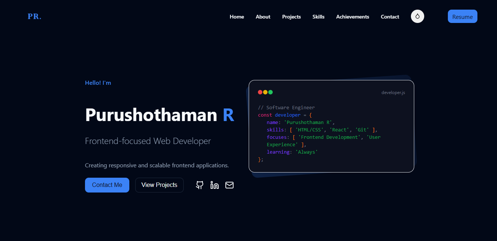

# 🚀 Purushothaman R - Web Developer Portfolio




[](https://app.netlify.com/projects/purushoth-dev/deploys)
[](https://purushoth-dev.netlify.app)

**A modern, responsive portfolio showcasing my skills as a Frontend-focused Web Developer**

[🌐 Live Demo](https://purushoth-dev.netlify.app) • [📄 Resume](src/resume/Purushothaman-R-Dev.pdf) • [📧 Contact](mailto:rpurushothaman500@gmail.com)


---

## ✨ Features

### 🎨 **Interactive Design**
- **Multi-Theme Support**: Switch between Blue, Purple, and Dark themes
- **Smooth Animations**: AOS (Animate On Scroll) for engaging page transitions
- **Responsive Layout**: Optimized for desktop, tablet, and mobile devices
- **Custom Typography**: Unique font styling with VIRUST font family

### 🛠 **Technical Features**
- **Form Validation**: Real-time contact form validation with error handling
- **File Downloads**: Resume download with success notifications
- **Swiper Integration**: Interactive project carousel for desktop
- **Local Storage**: Theme preference persistence across sessions
- **Mobile-First**: Responsive navigation with hamburger menu

### 📱 **User Experience**
- **Toast Notifications**: User feedback using Notyf library
- **Smooth Scrolling**: Seamless navigation between sections
- **Loading States**: Visual feedback for form submissions
- **Accessibility**: ARIA labels and keyboard navigation support

---

## 🛠 Tech Stack

### **Frontend Technologies**
- 
- 
- 

### **Frameworks & Libraries**
- 
- 
- 

### **External Services**
- **Web3Forms**: Contact form submission handling
- **Notyf**: Toast notifications and alerts
- **Netlify**: Hosting and deployment

---

## 📁 Project Structure

```
portfolio/
├── 📄 index.html              # Main HTML file
├── 📖 readme.md               # Project documentation
└── 📁 src/
    ├── 🎨 style.css           # Main stylesheet
    ├── ⚡ script.js           # JavaScript functionality
    ├── 📁 favicon/            # Favicon assets
    │   ├── favicon.ico
    │   ├── favicon.svg
    │   ├── apple-touch-icon.png
    │   └── site.webmanifest
    ├── 📁 font/               # Custom fonts
    │   ├── VIRUST.ttf
    │   └── VIRUST.woff2
    ├── 📁 images/             # Project images
    │   ├── Screenshot.png
    │   ├── user.jpeg
    │   └── project-images/
    └── 📁 resume/             # Resume files
        └── Purushothaman-R-Dev.pdf
```

---

## 🚀 Getting Started

### **Prerequisites**
- A modern web browser (Chrome, Firefox, Safari, Edge)
- No additional dependencies required

### **Local Development**

1. **Clone the repository**
   ```bash
   git clone https://github.com/FrontEndExplorer-Temp/Portfolio.git
   cd Portfolio
   ```

2. **Open in browser**
   - Simply open `index.html` directly in your web browser
   - Or drag and drop the `index.html` file into your browser window

3. **That's it!**
   - No server setup required
   - No dependencies to install
   - Works immediately in any modern browser

---

## 🎯 Key Sections

### **🏠 Home**
- Hero section with introduction
- Call-to-action buttons
- Social media links

### **👨‍💻 About**
- Personal background and experience
- Professional summary
- Career objectives

### **💼 Projects**
- Showcase of completed projects
- Interactive project carousel
- Live demo and GitHub links

### **🛠 Skills**
- Technical skills visualization
- Proficiency levels
- Technology categories

### **🏆 Achievements**
- Certifications and awards
- Professional milestones
- Recognition highlights

### **📧 Contact**
- Contact form with validation
- Direct contact information
- Social media presence

---

## 🎨 Theme System

The portfolio features a sophisticated theme system with three distinct themes:

- **🔵 Blue Theme** (Default): Professional and modern
- **🟣 Purple Theme**: Creative and vibrant
- **⚫ Dark Theme**: Sleek and contemporary

**Features:**
- Theme persistence using localStorage
- Smooth transitions between themes
- Consistent color scheme across all components

---

## 📱 Responsive Design

The portfolio is fully responsive and optimized for:

- **Desktop** (1200px+): Full layout with all features
- **Tablet** (768px - 1199px): Adapted layout with touch-friendly elements
- **Mobile** (320px - 767px): Mobile-first design with hamburger navigation

---

## 🔧 Customization

### **Adding New Themes**
1. Define CSS variables in `style.css`
2. Add theme class to HTML
3. Update theme selector in JavaScript

### **Modifying Content**
- Update `index.html` for content changes
- Modify `style.css` for styling
- Edit `script.js` for functionality

### **Adding Projects**
1. Add project images to `src/images/`
2. Update project section in HTML
3. Configure Swiper settings if needed

---

## 🚀 Deployment

### **Netlify (Recommended)**
1. Connect your GitHub repository to Netlify
2. Set build command: `None` (static site)
3. Set publish directory: `/` (root)
4. Deploy automatically on push

### **Other Platforms**
- **Vercel**: Connect repository and deploy
- **GitHub Pages**: Enable in repository settings
- **Firebase Hosting**: Use Firebase CLI

---

## 📊 Performance

- **Lighthouse Score**: 95+ across all metrics
- **Loading Speed**: Optimized images and assets
- **SEO Optimized**: Meta tags and structured data
- **Accessibility**: WCAG 2.1 compliant

---

## 🤝 Contributing

While this is a personal portfolio, suggestions and feedback are welcome:

1. Fork the repository
2. Create a feature branch
3. Make your changes
4. Submit a pull request

---

## 📄 License

This project is open source and available under the [MIT License](LICENSE).

---

## 📞 Contact

- **Portfolio**: [purushoth-dev.netlify.app](https://purushoth-dev.netlify.app)
- **Email**: [rpurushothaman500@gmail.com](mailto:rpurushothaman500@gmail.com)
- **GitHub**: [@FrontEndExplorer-Temp](https://github.com/FrontEndExplorer-Temp)

---


**Made with ❤️ by Purushothaman R**

[⬆ Back to Top](#-purushothaman-r---web-developer-portfolio)

